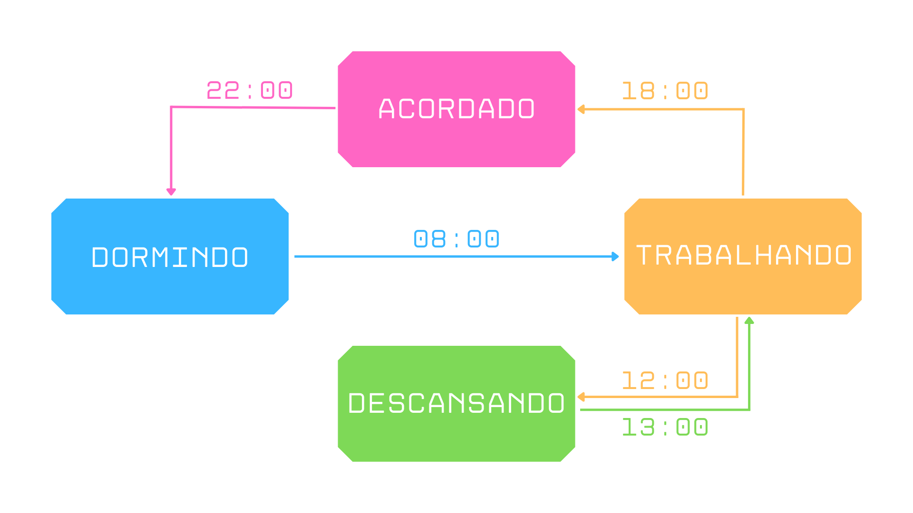

# Máquina de Estados Finitos

#### Diagrama de estados

#### Tabela de transição de estados

| Estado \ Entrada | 08:00       | 12:00       | 13:00       | 18:00       | 22:00       |
|------------------|-------------|-------------|-------------|-------------|-------------|
| **Acordado**     |             |             |             |             | Dormindo    |
| **Trabalhando**  |             | Descansando |             | Acordado    |             |
| **Descansando**  |             |             | Trabalhando |             |             |
| **Dormindo**     | Trabalhando |             |             |             |             |